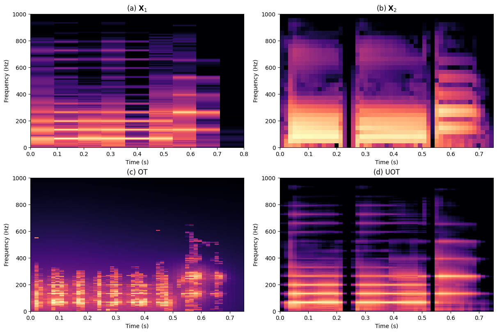

# Enhancing time-frequency resolution via optimal transport fusion of spectrograms

Companion code for the paper Enhancing time-frequency resolution via optimal transport fusion of spectrograms, see [TODO: arxiv link].

In this repo you will find the implementation of an unbalanced optimal transport (UOT) algorithm to enhance the resolution of spectrograms. Starting from the time-domain signal, we first compute two spectrograms using two different window lengths. We then compute the barycenter distribution using UOT.

In this repo you will find:

* `tutorial.ipynb`: notebook tutorial showing how to compute super-resolutions spectrograms.
* `paper_figures.ipynb`: notebook to reproduce the figures of the paper.
* `data/`: folder containing data, e.g. the Euclidean OT barycenter used for Fig. 3 (which is slow to compute).
* `example_sounds/`: sounds used for the paper. Sources:

    * `bass_notes.wav`: https://freesound.org/people/2opremio/sounds/255833/ (with manually included silences between notes.)
    * `ring_necked_dove.wav`: https://xeno-canto.org/1059259 (slice from 1.6s to 2.8s)
    * `woman_speech.wav`: https://keithito.com/LJ-Speech-Dataset/ (original track name: `LJ001-0001.wav`, slice from 2.4s to 4.02s)
    * `man_speech.wav`: https://www.spsc.tugraz.at/databases-and-tools/ptdb-tug-pitch-tracking-database-from-graz-university-of-technology.html (ID: M02_si746, slice from 2.5s to 6s)
* `src/`: folder containing code (more info below).

Some results:



# Install

To run the code we recommend to follow these steps:

1. **Clone the project**: in a terminal, run

````
git clone https://github.com/davidvaldiviad/fusion-ot.git
````

Then go to the folder:

`````
cd fusion-ot
`````

2. **Before installing any dependencies we recommend you create a Python virtual environment:**

`````
python3 -m venv .venv
source .venv/bin/activate
`````

3. Finally, **install the dependencies**:

````
pip install -r requirements.txt
````

# About the code

The different functions used to compute barycenters and display the results are located in the folder `src`. You'll find:

* `barycenter.py`: compute OT and UOT barycenters.
* `cost_matrix.py`: compute the different cost matrices used throughout the paper
* `display.py`: utility functions to display figures.
* `spectrogram.py`: contains Spectrogram class used in the code.
* `utils.py`: accessory functions.
